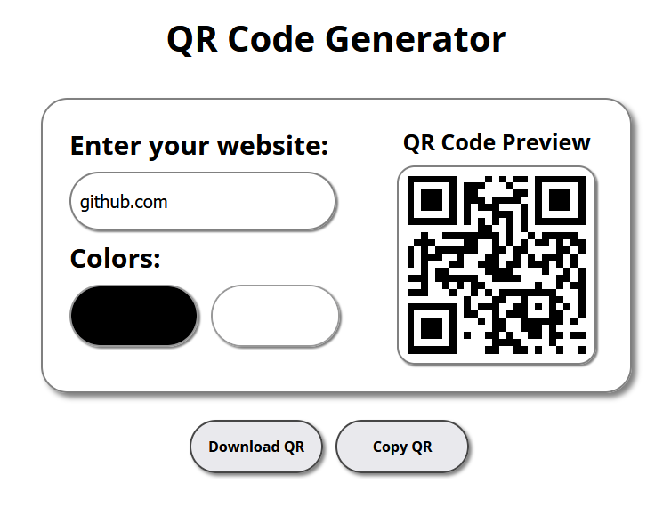

# QR Code Generator

## Description

This is a simple and interactive QR Code Generator that allows users to enter a website URL, customize QR code colors, and download or copy the generated QR code. The project utilizes `QRCode.js` for QR generation.

## Features

- **Real-time QR Code Generation**: Generates a QR code dynamically as the user types.
- **Custom Colors**: Users can select both the QR code color and background color.
- **Download QR Code**: The generated QR code can be downloaded as an image.
- **Copy QR Code**: Allows copying the QR code to the clipboard.

## Technologies Used

- **HTML**: Structure of the web page.
- **CSS**: Basic styling (linked via `styles.css`).
- **JavaScript**: Handles QR code generation, downloading, and copying functionalities.
- **QRCode.js**: External JavaScript library for QR code creation.

## Installation & Usage

1. Clone this repository:
   ```sh
   git clone https://github.com/YonaGonca/qrcode-generator.git
   cd qrcode-generator
   ```
2. Open `index.html` in a browser.
3. Enter a URL, customize colors, and generate your QR code.
4. Download or copy the QR code as needed.

## Files Structure

```
qrcode-generator/
│── index.html      # Main HTML file
│── styles.css      # Stylesheet
│── scripts.js      # JavaScript logic
│── README.md       # Project documentation
└── LICENSE         # LICENSE
```

## External Dependencies

This project uses `QRCode.js`, which is included via CDN:

```html
<script src="https://cdnjs.cloudflare.com/ajax/libs/qrcodejs/1.0.0/qrcode.min.js"></script>
```

## Functions Breakdown

### `generateQR()`

- Retrieves user input for the URL, QR color, and background color.
- Updates the QR code dynamically.

### `downloadQR()`

- Allows users to download the QR code as a PNG image.

### `copyQR()`

- Copies the QR code image to the clipboard.

## Screenshot



## License

This project is open-source under the [MIT License](LICENSE).
